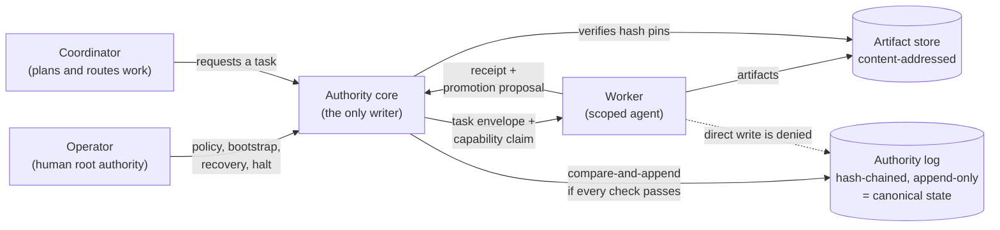

# agent-authority-sim

> A deterministic, model-free simulator of a finite authority model for AI agents: agents get narrow, scoped authority and return evidence, and a separate trusted layer decides what becomes canonical state.

[](https://github.com/mrsarac/agent-authority-sim/actions/workflows/tests.yml)

**Status:** research prototype, spec `0.1.0`. The full suite is 207/207 passing. The full simulator/property proof is **not** established (see [What is not proved yet](#what-is-not-proved-yet)).

This is a simulator proof, not a production agent runtime. It makes no claim about cryptography, OS isolation, real CLI adapters, secret injection, remote nodes, failover or production safety.

## The idea in plain English

When several AI agents work on one project, someone has to decide which results count. If an agent can write straight into the shared state, one confused or compromised agent can overwrite everything. This model splits the job in two:

1. **Agents (workers) get small, scoped permissions.** Each task comes with a capability: which actions are allowed, in which workspace, on which inputs, with which budget, until when. A child capability can only be narrower than its parent.
2. **Agents return evidence, not decisions.** A worker produces artifacts (stored by content hash) and a receipt that says what happened. It can then *propose* that its result be promoted. A proposal has no power to change anything.
3. **One trusted layer decides.** The authority core is the only writer of canonical state. It checks the proposal against the current authority epoch and lease, the capability, the policy, the receipt's evidence, the artifact hashes and the expected log head. Only if every check passes does it append one event to a hash-chained log.
4. **A human operator holds the root.** Bootstrap, recovery after a contradiction, and emergency halt need operator authorization. When the core cannot establish one valid state, it stops promoting and waits for recovery instead of guessing.

Everything fails closed: unknown fields, unknown adapter features, stale epochs, expired leases, replayed requests and mismatched hashes are denied with a generic reason code, and nothing is written.



The checks run in a fixed order before any append: schema, operator and object bindings, epoch and lease generation, lease expiry on the core's clock, task/capability/policy/revocation state, capability attenuation and budgets, receipt state and evidence trust class, artifact hash pins, expected log head, and replay/idempotency. The full order is in [`spec/v0.1.0/design.md`](spec/v0.1.0/design.md), section 11.2.

## What the simulator covers today

All of it runs in memory, with a fake clock and no model, network, subprocess, real CLI, secret or host filesystem access in `src/`.

- **Strict contracts.** Eight document kinds (authority lease, task envelope, capability claim, artifact manifest, execution receipt, promotion proposal, promotion decision, authority event) parsed against one JSON Schema. Unknown fields are rejected. Valid and invalid test vectors live in `spec/v0.1.0/`.
- **Canonical bytes.** One canonical JSON encoding, so the same object always hashes the same way.
- **Authority log.** Hash-chained events, compare-and-append against an expected head, atomic behavior under injected faults, byte-identical replay.
- **Closed transition matrices.** Seven state machines (authority writer, task, capability, run, receipt, promotion, policy) and the event-binding matrix are enumerated as closed tables; any transition not listed is denied.
- **Authority leases.** Initialization, renewal, reissue, release, acquisition, expiry at an exact boundary, contradiction recovery, emergency halt and restore. Property tests P01 (single writer per epoch) and P02 (stale or expired authority cannot promote) pass.
- **Capabilities and policy.** Monotonic attenuation, revocation, policy versions that cannot roll back without operator recovery.
- **Fake runtime.** Scripted fake workers and adapters with budgets, cancellation and timeouts; workers can only submit evidence.
- **Artifacts and receipts.** Content and manifest hash pins, receipt trust classes (`governor_observed` > `adapter_parsed` > `tool_self_reported` > `model_asserted`), fail-closed artifact recovery.
- **Spec lock.** `spec/v0.1.0/spec-lock.json` pins the size and SHA-256 of every spec file and of `requirements.lock`; tests fail if any of them changes.

## What is not proved yet

- The promotion decision path with its compare-and-append is not integrated. The core can check whether promotion would be allowed (P01/P02), but the full promotion flow is the next gate.
- The property set P03–P26 is not complete as a final set, and the invalid vectors X01–X03 are deferred.
- The named "false-green" mutation demonstrations (break a guard, watch the matching test fail) are not all recorded yet.
- There is no end-to-end proof runner and no two-run determinism check yet.
- An independent review of the latest code is still pending.
- Nothing here is a production guarantee. Section 12 of [`spec/v0.1.0/property-test-catalog.md`](spec/v0.1.0/property-test-catalog.md) lists what even a full pass would not prove.

## Run the tests

Requirements: Python **3.11.14** exactly (the spec-lock tests check the interpreter version) on macOS arm64. `requirements.lock` pins wheel hashes generated on macOS arm64, so `pip install --require-hashes` works only there.

```bash
python3.11 -m venv .venv
.venv/bin/pip install --require-hashes -r requirements.lock
PYTHONPATH=src:. .venv/bin/python -m unittest discover -s tests
```

Expected result: `Ran 207 tests` and `OK`, in about two minutes on a laptop. The suite prints `SPEC_LOCK_INVALID` several times; those lines come from negative tests that tamper with the spec lock on purpose.

To check only the spec lock:

```bash
PYTHONPATH=src:. .venv/bin/python -m unittest tests.unit.test_spec_lock -v
```

CI runs the full suite on every push and pull request on a macOS arm64 runner with Python 3.11.14.

## Layout

| Path | What it is |
|---|---|
| `spec/v0.1.0/` | The locked spec: design, state machines, property-test catalog, JSON Schema, valid and invalid vectors. |
| `src/authority_sim/` | The simulator. `authority_core.py` is the single writer; `fake_runtime.py` holds the fake workers and adapters. |
| `tests/unit/` | Unit tests per module. |
| `tests/properties/` | Property tests and the closed transition matrices. |
| `tests/security/` | Error privacy (no paths, secrets or digests in errors) and the public API surface. |
| `scripts/verify_spec_lock.py` | Verifies the spec bundle against `spec-lock.json`. |

## Where this came from

The spec was written in August 2026 as part of a private research note on agent authority, and the simulator was built against it with AI coding agents under test-driven development. For this public release, internal project and host names were replaced with neutral terms ("operator", "coordinator", "decision plane"), the spec lock was regenerated, and the history was squashed into one commit. The rules and the tests were not changed; the suite passed 207/207 before and after the renaming.

The repository is public for reading and review. There is no deploy target: nothing here runs as a service.

## License

[MIT](LICENSE) © 2026 Mustafa Saraç
